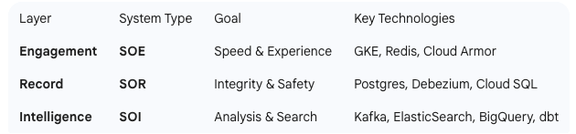

**Architecture Flow**
**1. The Three-Layer Framework**

**Systems of Engagement (SOE)**
   This is where the customer "touches" the bank.

    Components: Web/Mobile UI, API Gateway, Auth Service, and Rate Limiter.
    Focus: User experience, low latency, and security.
    Data: Transient (sessions, tokens).

**Systems of Record (SOR)**
This is the "Single Source of Truth." If this data is lost, the bank is in trouble.

    Components: Customer Service, Relational DB (Postgres/Cloud SQL), and Debezium/CDC.
    Focus: ACID compliance, data integrity, and "Current State."
    Data: Highly structured, canonical customer profiles.

**Systems of Intelligence (SOI)**

This is where data becomes "smart" for the business.
    
    Components: Kafka (the backbone), ElasticSearch (Search), BigQuery (Warehouse), and dbt (Transforms).
    Focus: Pattern matching, historical trends, and fast lookups.
    Data: Event streams, analytical models, and search indexes.

This flow represents the "Golden Path" of a customer data update in a Tier-1 enterprise.

* Request Layer: Mobile/Web clients hit the Global Load Balancer. Traffic is filtered by Cloud Armor (Rate Limiting).
* Service Layer (GKE): The Customer Service receives the update. It performs a Transactional Outbox write:
* Part A: Updates the customer table in Cloud SQL (Postgres).
* Part B: Inserts an event record into an outbox table in the same DB.
* Data Backbone (Kafka): Debezium monitors the Postgres logs (CDC) and streams the outbox event to the Kafka Topic (cdp.customer.platform.v1).
* Read Optimization (Redis): Upon a successful DB write, the service evicts the old record from Redis to ensure the next read is fresh.
* Downstream Projections:
* Search: A dedicated ES Consumer in GKE pulls from Kafka and pushes to ElasticSearch.
* Analytics: Kafka Connect streams events into BigQuery staging tables.
* Transformation (dbt): dbt runs scheduled jobs to turn raw JSON events into structured "Silver" and "Gold" tables for BI.

* **Auditability**: Every single change in the SOR is recorded in the SOI via Kafka. You have a permanent history of what changed, by whom, and when.
* **Fault Tolerance**: If BigQuery is down for maintenance, the SOE and SOR continue working. Kafka simply holds the messages until BigQuery is ready.
* **Security**: By using an API Gateway with mTLS, even if a hacker gets into the cluster, they cannot "sniff" traffic between services

* 