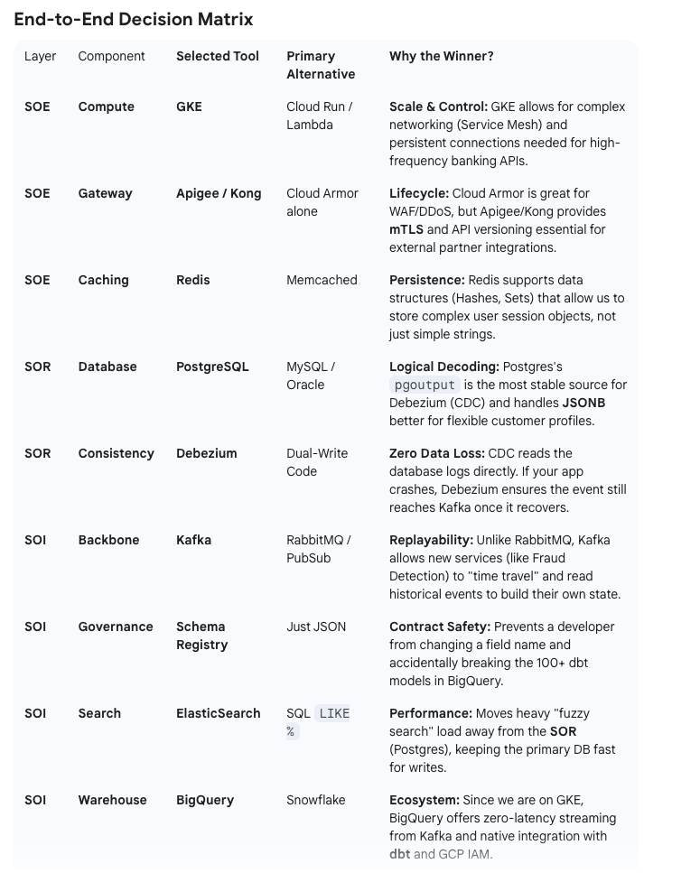
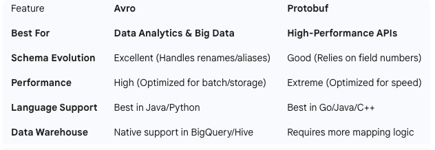

The design decisions behind a high-tier CDP like the one we've built are driven by the "Four Pillars of Enterprise Architecture": Reliability, Scalability, Observability, and Maintainability.

Here is the "Why" behind each tool selection:

1. **Relational DB (Postgres) vs. NoSQL**
Decision: Use Postgres for the System of Record (SOR).

* The "Why": Customer data is the most sensitive asset in a bank.
* We need ACID compliance (Atomicity, Consistency, Isolation, Durability) to ensure that if a transaction fails halfway, the data isn't corrupted.
* NoSQL (like MongoDB) is great for speed, but for "The Truth," you want the strict schema and relational integrity of Postgres.

2. **Debezium & Outbox Pattern vs. Dual Writing**
   Decision: Use Change Data Capture (CDC) via Debezium.
* 
* The "Why": In "Dual Writing," your app code tries to write to the DB and Kafka at the same time.
* If the DB write succeeds but the network to Kafka fails, your System of Intelligence (SOI) is now out of sync.
* Result: By writing to an "Outbox" table in the same DB transaction and letting Debezium stream it, we achieve guaranteed eventual consistency.

3. **Kafka vs. Standard Message Queues (RabbitMQ)**
   Decision: Kafka as the event backbone.

* The "Why": Standard queues delete messages after they are read. Kafka is a distributed log; it stores messages for a set period.
* The Benefit: If you want to add a new service tomorrow (e.g., a "Fraud Detection Service"), it can "replay" the last 7 days of customer changes to build its own state.
* RabbitMQ can't do that easily.

4. **ElasticSearch vs. SQL Queries**
   Decision: Direct consumption from Kafka to ElasticSearch for searching.

* The "Why": Running LIKE %name% queries on a Postgres database with millions of rows is incredibly slow and puts a heavy load on your SOR.
* The Benefit: ElasticSearch is built for "Fuzzy Search." It moves the heavy lifting of searching away from your primary database, keeping your Customer API fast.

5. **dbt & BigQuery vs. Traditional ETL**

* Decision: ELT (Extract, Load, Transform) via dbt.
* The "Why": Traditional ETL (Transforming data before loading) is rigid.
* By loading raw events into BigQuery first and using dbt to transform them, your data engineers can change logic or fix bugs in the "Silver/Gold" layers without having to re-ingest all the data from Kafka.

**Kafka Message Schema:**

**The Final Verdict for your CDP**
For a "Real World" large-scale architecture like Monzo or LBG, the most common setup is actually a hybrid approach:

* Use Protobuf for your Internal APIs (Service A talking to Service B) to maximize speed.
* Use Avro for your Kafka Topics and BigQuery to maximize data stability and analytics flexibility.