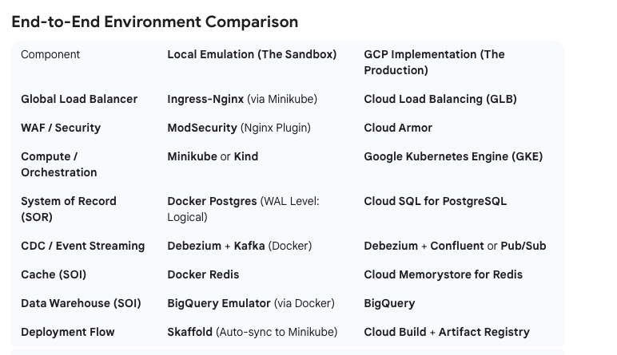
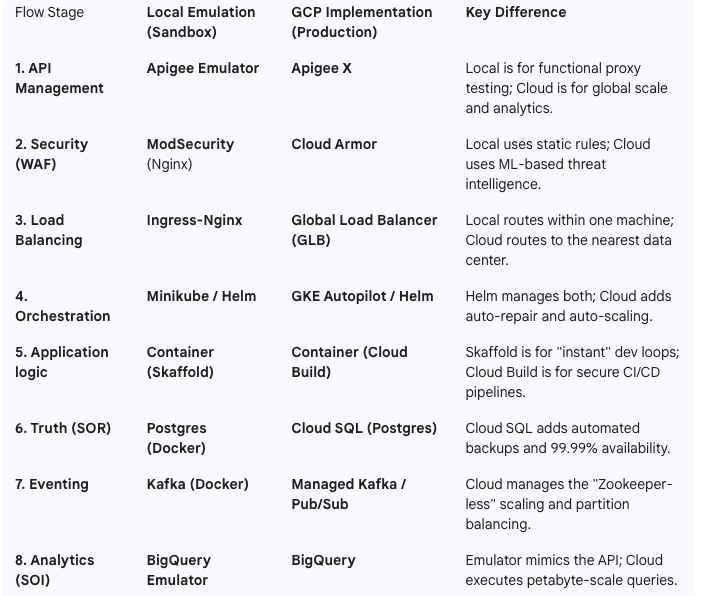
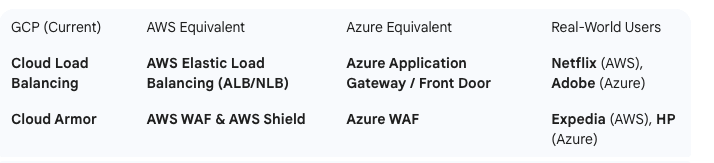

**we emulate GKE and the Global Load Balancer with Cloud Armor (WAF).**

**GLB**
Cloud Load Balancing (GLB) manages traffic distribution and scale.

**Cloud armor**(DDOS, WAF(pre conf rules against OWASF(SQL injection, XSS, etc0, Rate Limiting, BOT management, )
Cloud Armor manages security and defense.

* The **Open Web Application Security Project,** or OWASP, is an international non-profit organization dedicated to web application security.
* A **DDoS (Distributed Denial of Service)** attack overloads a website, server, or network with a massive flood of fake internet 
traffic from many compromised devices (a botnet), exhausting its resources (like bandwidth, memory, CPU) and making the service slow, unresponsive, or completely unavailable for legitimate users, causing downtime, lost revenue, and brand damage.  

other cloud neutral are **cloudfare and akamai**

**Flow**

* Incoming Traffic: A user sends a request (e.g., https://example.com) to your application.
* Edge Entry: The request hits the nearest Google Point of Presence (PoP) globally (e.g., a user in London hits a London edge node, not your server in the US).
* Cloud Armor Inspection: Before the Load Balancer processes the request, Cloud Armor inspects it against your security policies (WAF rules, IP blocklists, Rate Limits).
* If malicious: Blocked immediately at the edge (403 Forbidden).
* If legitimate: Allowed to pass.
* Load Balancing: The GLB routes the allowed traffic to the closest healthy backend instance (VM, GKE container, or Cloud Run service).\

1. Where Apigee Fits (The "Sandwich" Architecture)In a professional enterprise setup,
2. traffic usually flows in this order:Internet $\rightarrow$ GLB (Routes global traffic to the right place).
3. GLB $\rightarrow$ Cloud Armor (Blocks hackers, bots, and DDoS attacks).
4. Cloud Armor $\rightarrow$ Apigee (Handles API keys, rate limits, and data transformation).
5. Apigee $\rightarrow$ Backend Service (Your actual code/database).

Summary: The "Front Door" Trio
* **Cloud Load Balancer**: "I will get the person to the right building."
* **Cloud Armor**: "I will make sure the person isn't carrying a weapon."
* **Apigee**: "I will check their ID card, tell them which room to go to, and keep a log of everything they do so we can bill them later."

**Entry & Security (GLB & WAF)**

* Local: You use an Ingress Controller to route traffic.
* ModSecurity acts as your local "Cloud Armor," using standard OWASP rules to block things like SQL injection.
* Cloud: Google handles the worldwide edge network. Cloud Armor is managed at the Google edge, so malicious traffic 
is blocked before it even reaches your GKE cluster.

**Compute (GKE)**
Local: Minikube runs a single-node cluster. You use Skaffold to make "Cloud-like" deployments happen every time you save your code.
Cloud: GKE Autopilot manages the nodes for you. It scales automatically based on traffic and provides high availability across different zones.
