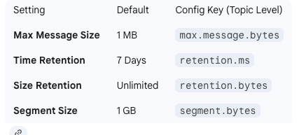
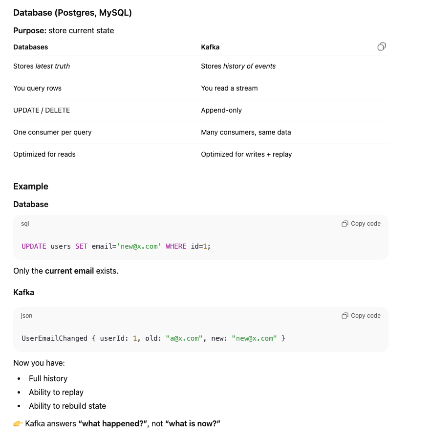
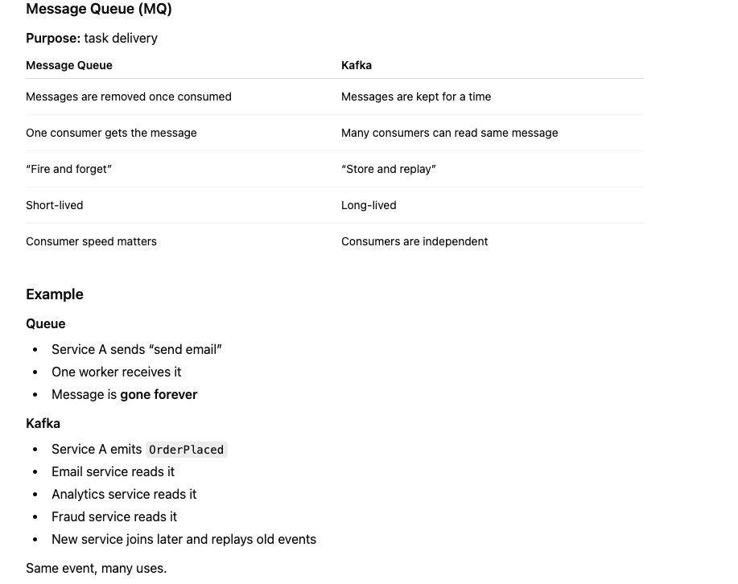
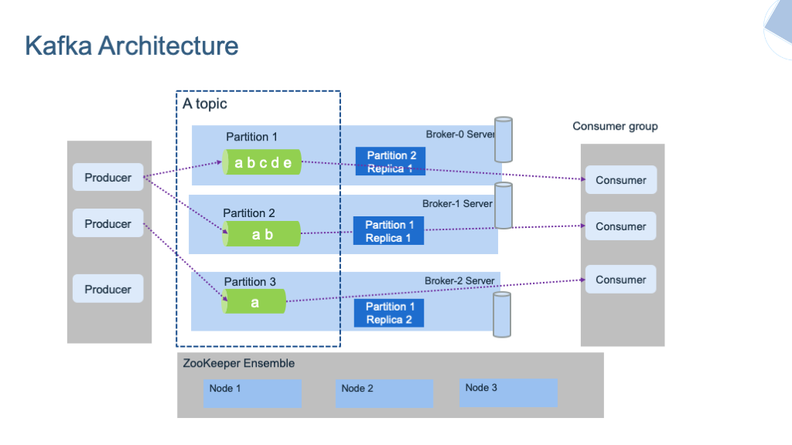
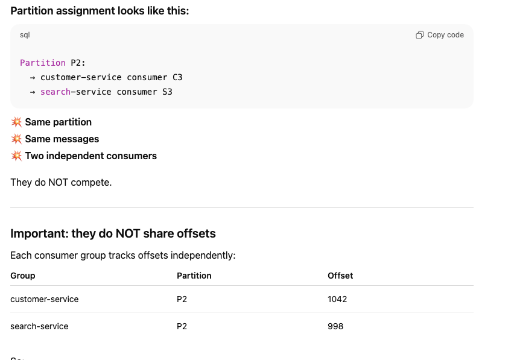
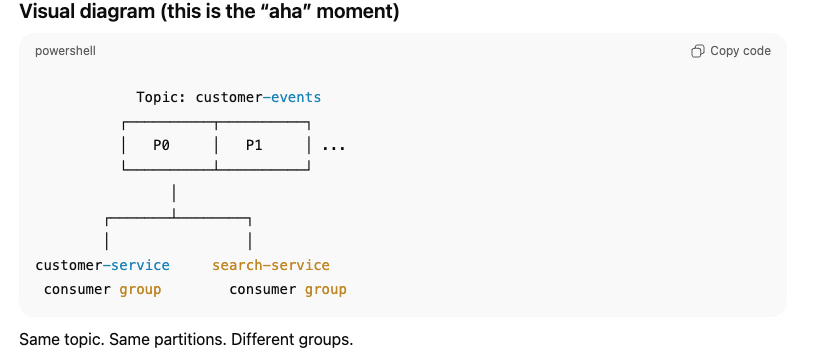
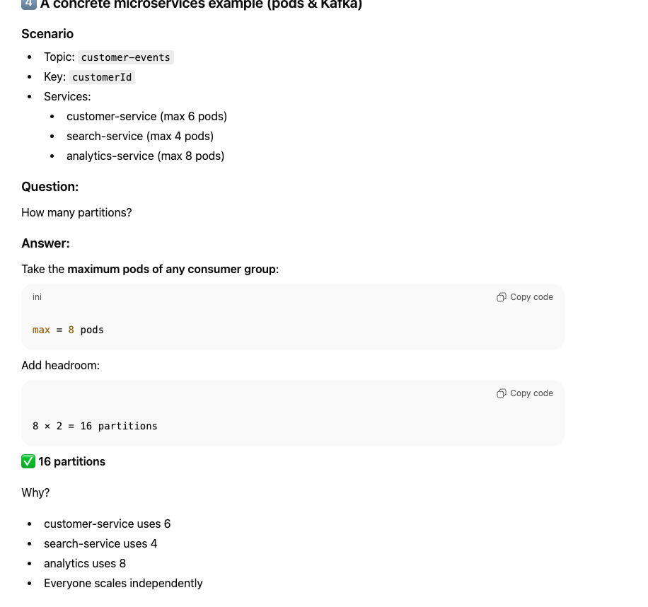

    Kafka is a distributed event log.
    Not a database.
    Not just a message queue.

Think of it as:

    A very fast, append-only log that many systems can write to and read from,
    independently, at their own pace.

    Kafka is just a series of append-only files 
    where data is written in order and never changed (immutable).

**Kafka in one mental picture**

1. Imagine a shared notebook:
2. Everyone can append pages at the end (producers)
3. Anyone can read from any page they want (consumers)
4. Pages are never erased immediately
5. Multiple readers can read the same pages independently
6. That notebook is Kafka.

Kafka Defaults
* Default Time Retention: 7 Days (log.retention.hours=168). Default Size Retention: Unlimited (-1).
* Default Message Size: 1 MB (message.max.bytes).Technically, there is no hard-coded "max," but it is effectively limited by your Broker's RAM and the replica.fetch.max.bytes setting.While you can set it to 100 MB+, doing so often causes "Long GC Pauses" (the Java Garbage Collector freezes the broker while trying to move the giant message in RAM).

**How Kafka is different from a Database**

**How Kafka is different from a Message Queue (RabbitMQ, SQS)**

**One-line takeaway**

* DB: “What is true right now?”
* Queue: “Do this once”
* Kafka: “This happened — remember it”

**When Kafka is the right tool**

Kafka is great when you need:

* Event streaming
* Data pipelines (CDC, ETL)
* Microservices communication at scale
* Audit logs
* Real-time analytics
* Decoupled architectures

Typical examples:

* Debezium → Kafka → BigQuery
* Payments, orders, tracking events
* Activity streams

Kafka Architecture:

**The Core Components (The "Who")**
* **Producers**: Applications that send data (records) to Kafka.
* **Consumers**: Applications that read data from Kafka.
* **Brokers**: The servers that form the Kafka cluster. They store the data and serve the clients.
* **Topics**: The "folders" where data is categorized.
* **Partitions**: The "files" inside those folders. This is how Kafka scales.

* Sequential Disk I/O is fast because disks love doing the same thing in order
* — and Kafka is built entirely around that fact
* WAL (Write-Ahead Log) → sequential

**Internal Storage: How it handles "The Log"**

Kafka does not use a complex B-Tree or Heap structure like a database. It uses Sequential Disk I/O,
which is nearly as fast as memory.
* **The Commit Log:** When a message arrives, it is appended to the end of a partition log.
* **The Offset:** Every message is assigned a unique, increasing ID called an offset. Consumers use this number to "bookmark" their place in the stream.
* **Segments:** To prevent a single file from growing to 100TB, Kafka breaks partitions into smaller segments. When a segment reaches a certain size (e.g., 1GB), it is closed and a new "active" segment is created

**Parallelism: The "Secret Sauce"**
Kafka’s high performance comes from Partitions and Consumer Groups.
* Partitioning: A single topic can be split into 100 partitions across 10 different brokers. This allows 100 different producers to write at the same time.
* Consumer Groups: You can have multiple instances of your app in one "Group."Kafka ensures that each partition is assigned to only one consumer in that group. If you have 4 partitions and 4 consumers, they all work in parallel. If one consumer dies, Kafka "rebalances" and gives its partitions to the remaining three
*fan out*

**One-sentence rule to remember**

    Pick partitions based on the maximum number of consumer pods you will ever want to run in parallel — then double it.

**4. Reliability: Replication (ISR)**
* Kafka ensures your data isn't lost if a server (Broker) catches fire.
* Leader/Follower: Each partition has one Leader (which handles all reads/writes) and several Followers (which just copy the data).
* ISR (In-Sync Replicas): If a follower is caught up with the leader, it is considered "In-Sync."
* Failover: If the leader broker crashes, the cluster automatically elects a new leader from the ISR set.

**Modern Shift: ZooKeeper vs. KRaft**
* For a long time, Kafka required a separate tool called ZooKeeper to manage cluster metadata (who is the leader? which brokers are alive?).
* **The Legacy (ZooKeeper):** External coordination. It became a bottleneck for clusters with millions of partitions.
* **The Future (KRaft):** As of Kafka 3.3+, Kafka uses KRaft (Kafka Raft). It manages its own metadata internally using a special "Metadata Topic." This makes Kafka much faster to start and easier to manage.

**Summary: Why is Kafka so fast?**
* Zero-Copy: Kafka moves data directly from the disk cache to the network buffer without the CPU ever "touching" the data.
  * Why databases usually can’t do this 
  * Kafka uses OS features like sendfile(). disk -> os  cache ->Network card
  * Databases:
    * Modify records
    * Apply filters
    * Do joins
    * Enforce transactions
    * They must touch the data. 
  * Kafka:
    * Just streams bytes
    * Doesn’t interpret payload 
    * Doesn’t change it

* Sequential I/O: Appending to a file is infinitely faster than searching a random index.
* Batching: Producers and consumers group messages together to reduce network overhead. 
  * For example The two knobs that control this (producer side) Kafka producers use two main rules to decide when to send:
         Batch size limit  “Send when the batch is full”  Example: Batch size = 16 KB If you fill it quickly → send immediately
  * Time limit (linger) “Send whatever I have after N milliseconds”

    Kafka is fast because it writes in order, moves data only once, and sends it in big chunks instead of tiny pieces.