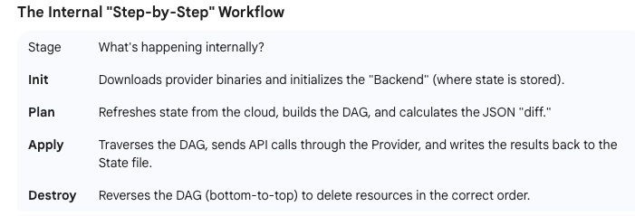

Terraform is an **open-source Infrastructure as Code (IaC)** tool created by HashiCorp that allows developers
to define, provision, and manage cloud/on-premise infrastructure using declarative configuration files!

Summary: The Internal Loop
* **terraform init**: Downloads the  Provider binary and creates the .terraform/ folder and the .terraform.lock.hcl.
* **terraform plan:**
  * Reads main.tf. 
  * Reads terraform.tfstate. 
  * Calls the Docker API to check if the container 793c3fd637f5 still exists. 
  * Calculates the "Diff."
  
* **terraform apply:**
  * Sends a POST /containers/create request via the  Provider. 
  * Receives the new Container ID. 
  * Updates terraform.tfstate with the new ID.